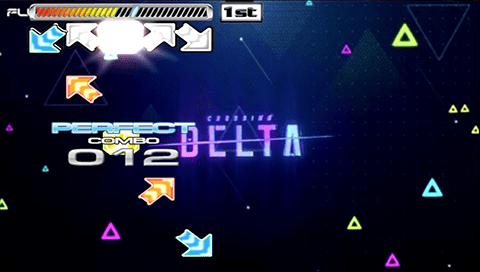

# Pump It Up Exceed/Zero Portable tools

Hosts tools to mod the two Pump It Up games released to the PlayStation Portable.

I recently discovered the two games and I find fascinating the idea of having a pocketable PIU with the latest charts.



## Port charts and songs

The entire process is experimental. While there is a proof of success, the converted songs might have some problems as `piu-makestx` needs to be polished more. The Exceed/Zero engine is also old and limited and it does not suppor the effects found in the chart from the latest games.

Also the following bugs are found when converting a SSC chart into STX:

* The chart will have a slightly off speed
* Press are currently buggy
* Tempo change are not yet supported
* I have no idea what the G/W/A/B/C are
* There is no way to port all the difficulties

### 1. Requirements

* [Go](https://go.dev/dl/)
* [ffmpeg](https://ffmpeg.org/download.html) executable files
* An ISO of PIU Exceed Portable or PIU Zero Portable
* A [modified version of PIU Exceed Portable](https://github.com/Xeeynamo/piupsp-tools/releases/tag/piuex_mod) to load files from the memory stick
* [PSP tools](https://github.com/Xeeynamo/piupsp-tools/releases/tag/psptools) to convert audio and BGA to a PSP compatible format
* Either a real PSP or [PPSSPP emulator](https://ppsspp.org/downloads.html)
* The song+chart you want to install

### 2. Install the tools

After installing Go, open a terminal and run the following:

```shell
go install github.com/xeeynamo/piupsp-tools/piu-respack@latest
go install github.com/xeeynamo/piupsp-tools/piu-makestx@latest
```

### 3. Convert the chart

Get the SSC chart of the song you would like to convert and run the following command to convert, for example, the S10 chart as "normal difficulty":

```shell
piu-makestx 1640.ssc 1640.STX S10
```

### 4. Convert the song into AT3

```script
ffmpeg -i 1640.mp3 -ar 44100 1640.wav
./at3tool/at3tool -e 1640.wav 1640.AT3
```

### 5. Convert the BGA into PMF

```script
ffmpeg -i 1640.mpg -map 0:0 -vf scale=480:272:flags=lanczos -vb 4M 1640.avi
./psmfenc -video -avgb 1000 -peakb 2000 -2pass 1640.avi 1640.BSF
./psmfmux 1640.BSF 1640.MPS
./PsmfComposerCMD 1640.MPS 1640.PMF
```

### 6. Modify the game

Open the game ISO and copy all the content of `PSP_GAME\USDIR` into a new folder in your PSP memory stick called `PIU`. Replace one of the existing AT3 files in the folder `PIU/AUDIO` with the one you created. I would choose `A06.AT3` as it is the very first song that is shown in the Arcade Mode. Then do the same with your PMF into `PIU/BGA`.

Now you need to put the chart inside the file `STEP.DAT`. Unpack `STEP.DAT`:

```script
piu-respack x STEP.DAT
```

Put your STX file inside the new created folder `STEP` and repack it:

```script
piu-respack p STEP STEP.DAT
```

### 7. Try it and have fun

As I previously mentioned, the process and the result is a proof of concept and I can streamline it if there is interest.

## To do

* Modify the images with TPP format  (they are essentially a TM2 picture)
* Find the list of songs and their difficulties to allow expanding the selection rather than replacing existing songs
* Polish the SSC to STX conversion

## Special thanks

* [hansscholt](https://github.com/hansscholt) to have shared with me his [STX parser](https://github.com/hansscholt/nx20/blob/master/nx20/STXReader.cs)
